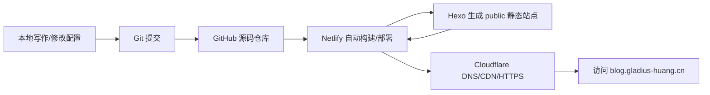
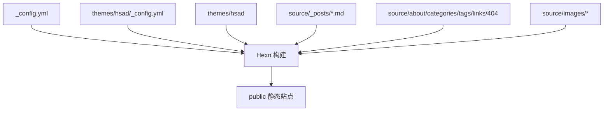

# 个人博客技术栈与项目构成说明

本文档用于在以后遗忘项目细节时，快速回忆本博客的技术栈、代码目录、主题来源、构建部署流程和域名访问链路。

## 1. 项目定位

这是一个基于 Hexo 的个人静态博客项目。

博客源码使用 Git 管理并托管在 GitHub。每次完成内容或配置更新后，将代码提交并推送到 GitHub，Netlify 会自动拉取最新代码、安装依赖、执行 Hexo 构建，并发布生成后的静态网页。域名 `blog.gladius-huang.cn` 由 Cloudflare 管理 DNS 解析，同时通过 Cloudflare 提供 HTTPS、CDN 缓存加速和基础安全防护。

整体链路如下：



## 2. 技术栈总览

| 技术/平台 | 作用 |
| --- | --- |
| Hexo | 静态博客生成框架，把 Markdown、配置和主题模板构建成 HTML/CSS/JS |
| hsad Theme | 当前使用的 Hexo 主题，提供左侧视觉侧栏、文章列表、归档、分类、标签、友链、关于页等页面样式 |
| Markdown | 博客文章和页面内容的主要写作格式 |
| Pug Renderer | `hexo-render-pug`，用于渲染 hsad 主题中的 `.pug` 模板 |
| Git | 本地版本管理 |
| GitHub | 远程源码托管，并作为 Netlify 自动部署触发源 |
| Netlify | 自动安装依赖、执行 Hexo 构建、发布静态站点 |
| Cloudflare | 管理域名 DNS、HTTPS、CDN 缓存和基础安全防护 |

## 3. 主工程位置

本地工作区根目录：

```text
D:\blog
```

真正的 Hexo 主工程：

```text
D:\blog\my_blog
```

日常写文章、改配置、构建和提交，主要都应在 `D:\blog\my_blog` 中进行。

## 4. 当前目录结构

```text
D:\blog\my_blog
├── _config.yml
├── package.json
├── package-lock.json
├── TECHNICAL_OVERVIEW.md
├── db.json
├── scaffolds
│   ├── draft.md
│   ├── page.md
│   └── post.md
├── source
│   ├── _posts
│   │   └── hello-world.md
│   ├── about
│   │   └── index.md
│   ├── categories
│   │   └── index.md
│   ├── tags
│   │   └── index.md
│   ├── links
│   │   └── index.md
│   ├── 404.md
│   └── images
│       ├── avatar.jpg
│       └── background.jpg
├── themes
│   └── hsad
│       └── source
│           ├── css
│           └── js
├── public
├── node_modules
└── .github
    └── dependabot.yml
```

关键理解：

- `source` 是主要内容目录，文章、页面和个人站点图片都放在这里。
- `themes/hsad` 是当前主题源码目录，只保留主题模板、样式和脚本。
- `public` 是 Hexo 构建产物，不是主要编辑对象。
- `node_modules` 是依赖安装目录，不应手动修改。
- `db.json` 是 Hexo 缓存文件。

## 5. Hexo 主配置

主配置文件：

```text
D:\blog\my_blog\_config.yml
```

当前关键配置：

```yaml
title: 我的博客-黄奕涵
subtitle: '技术、学习与日常记录'
description: '黄奕涵的个人博客，记录技术学习、项目实践和日常思考。'
author: 黄奕涵
language: zh-CN
timezone: Asia/Shanghai
url: https://blog.gladius-huang.cn
permalink: :year/:month/:day/:title/
source_dir: source
public_dir: public
post_asset_folder: true
syntax_highlighter: prismjs
marked:
  breaks: true
theme: hsad
```

含义：

- `theme: hsad` 表示当前启用 `themes/hsad` 主题。
- `url` 已指向正式域名 `https://blog.gladius-huang.cn`。
- `source_dir: source` 表示文章、页面和图片资源都从 `source` 读取。
- `public_dir: public` 表示构建后的静态网页输出到 `public`。
- `post_asset_folder: true` 方便后续为单篇文章建立配图目录。
- `syntax_highlighter: prismjs` 与 hsad 主题代码块样式更匹配。
- `marked.breaks: true` 表示 Markdown 正文里的单个换行会在网页中显示为换行。

## 6. 主题说明

当前主题来自 GitHub：

```text
https://github.com/watanabe-hsad/hexo-theme-hsad
```

本地安装位置：

```text
D:\blog\my_blog\themes\hsad
```

主题配置文件：

```text
D:\blog\my_blog\themes\hsad\_config.yml
```

当前主题配置重点：

- `avatar: /images/avatar.jpg`
- `sidebar_background: /images/background.jpg`
- `brand_name: 黄奕涵的博客`
- `brand_subtitle: 记录生活和一点随想`
- `sidebar_note: “远离颠倒梦想，究竟涅槃。”`
- 菜单包含：首页、归档、分类、标签、友链、关于
- 社交链接包含：GitHub、Gitee、哔哩哔哩
- 页脚文案为：`事实上，时间会平等地对待每一个瞬间。`
- 页脚版权协议为：`CC BY-NC-SA 3.0 CN`

这个主题使用 Pug 模板，因此项目依赖中需要保留：

```json
"hexo-render-pug": "^..."
```

## 7. 内容目录

文章目录：

```text
D:\blog\my_blog\source\_posts
```

当前文章：

```text
事情发生在失败之后.md
```

基础页面：

| 路径 | 用途 |
| --- | --- |
| `source/about/index.md` | 关于页 |
| `source/categories/index.md` | 分类页 |
| `source/tags/index.md` | 标签页 |
| `source/links/index.md` | 友链页 |
| `source/404.md` | 404 页面 |

站点级图片资源：

```text
D:\blog\my_blog\source\images
```

当前站点级图片：

```text
avatar.jpg
background.jpg
```

这些图片构建后会出现在：

```text
D:\blog\my_blog\public\images
```

主题配置中引用的网页路径是：

```text
/images/avatar.jpg
/images/background.jpg
```

注意：个人图片不再放在 `themes/hsad/source/images`。主题目录只放主题本身的模板、CSS 和 JS。

## 8. 构建关系



## 9. 常用命令

进入主工程：

```bash
cd D:\blog\my_blog
```

本地预览：

```bash
npm run server
```

清理旧构建产物：

```bash
npm run clean
```

生成静态网站：

```bash
npm run build
```

Netlify 构建命令：

```bash
npm run netlify
```

新增文章：

```bash
npx hexo new "文章标题"
```

## 10. 部署链路

本项目主要依靠 Netlify 自动部署，不依赖本地 `hexo deploy`。

部署流程：

```text
本地修改文章/配置/主题
  -> git add
  -> git commit
  -> git push 到 GitHub
  -> Netlify 检测到仓库更新
  -> Netlify 安装 npm 依赖
  -> Netlify 执行 npm run netlify
  -> Hexo 生成 public
  -> Netlify 发布静态站点
  -> Cloudflare 将 blog.gladius-huang.cn 解析并加速到该站点
```

Netlify 推荐配置：

| 配置项 | 值 |
| --- | --- |
| Base directory | 如果仓库根目录是 `D:\blog`，填 `my_blog`；如果仓库根目录就是 `my_blog`，留空 |
| Build command | `npm run netlify` |
| Publish directory | `public` |

## 11. 域名访问链路

自定义域名：

```text
blog.gladius-huang.cn
```

访问过程：

```text
用户浏览器
  -> blog.gladius-huang.cn
  -> Cloudflare DNS/CDN/HTTPS
  -> Netlify 静态站点
  -> 返回 HTML/CSS/JS/图片
```

Cloudflare 负责：

- DNS 解析；
- HTTPS 证书；
- CDN 缓存加速；
- 基础安全防护。

## 12. 容易遗忘的关键点

- 主工程是 `D:\blog\my_blog`。
- 当前主题是 `hsad`，主题源码在 `themes/hsad`。
- 主题来自 `watanabe-hsad/hexo-theme-hsad`。
- hsad 主题需要 `hexo-render-pug`。
- 文章正文直属段落由主题 CSS 自动首行缩进，不需要在 Markdown 每段前手动敲空格。
- 主题 CSS 链接带版本参数，避免浏览器继续使用旧缓存。
- 文章图片不会自动生成“图 01”这类编号题注。
- Markdown 里的单行换行通过 `marked.breaks: true` 在网页端保留。
- 文章放在 `source/_posts`。
- 主页左侧栏头像和背景图放在 `source/images`。
- 主题目录 `themes/hsad` 只保留主题模板、CSS 和 JS。
- 构建输出是 `public`。
- `public` 和 `node_modules` 都不是主要手写目录。
- 部署靠 GitHub 推送触发 Netlify。
- 域名、HTTPS、CDN 由 Cloudflare 负责。

## 13. 后续可检查事项

1. 在 Netlify 后台确认构建命令是 `npm run netlify`。
2. 在 Netlify 后台确认发布目录是 `public`。
3. 如果仓库根目录不是 `my_blog`，确认 Netlify 的 Base directory 指向 `my_blog`。
4. 后续可以继续完善 `source/about/index.md` 和 `source/links/index.md`。
5. 如果需要评论系统，需要单独为 hsad 主题接入评论插件或修改模板。
